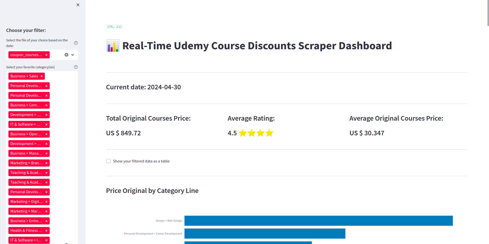
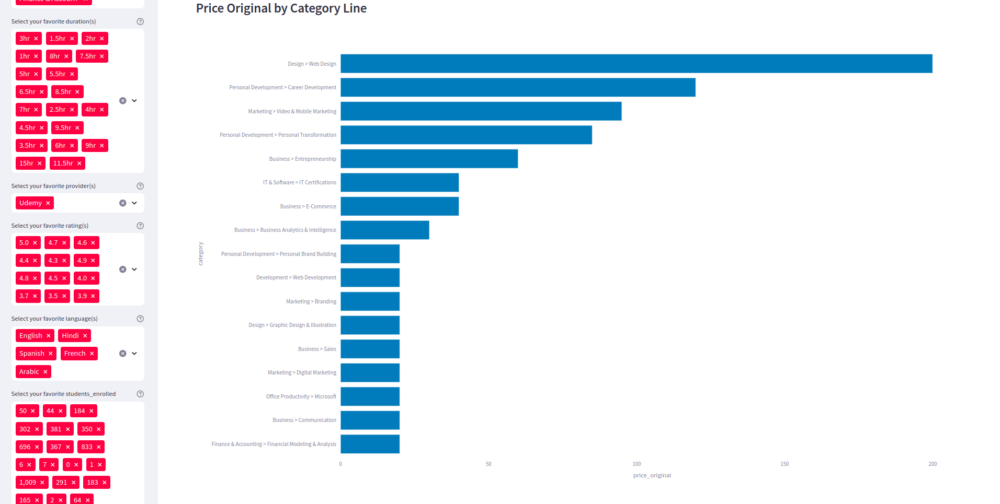
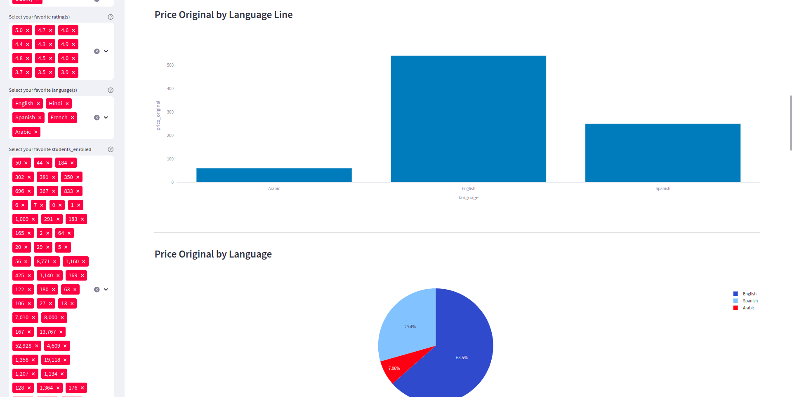
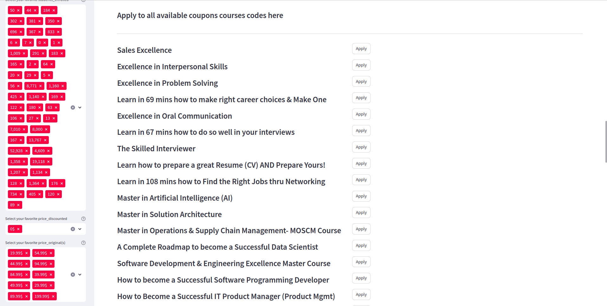

# real-discount-udemy-coupon-code-scraper-in-real-time
real discount udemy coupon code scraper in real time

## Deploy streamlit app on render.com free version with selenium integration

## The project description

## Real-Time Udemy Course Discounts Scraper and Dashboard

## Project Description:
#### I developed a comprehensive web scraping and data visualization project focusing on fetching real-time Udemy course discounts from a popular coupon website and presenting the data in an interactive dashboard. The project is built using Python and several libraries including Streamlit for the dashboard interface, Selenium for web scraping, Pandas for data manipulation, and Plotly Express for data visualization.

## Key Features:

#### Web Scraping: Utilized Selenium to scrape Udemy course discounts in real-time from a specific website.
#### Data Visualization: Presented the scraped data using Plotly Express to create interactive charts and graphs.
#### Dynamic Dashboard: Created a Streamlit dashboard allowing users to filter course discounts based on various criteria such as category, provider, duration, rating, language, and more.
#### Coupon Code Application: Provided functionality for users to apply coupon codes directly from the dashboard.
#### Automatic Data Update: Implemented automatic data update functionality to continuously scrape for new discounts at regular intervals.

## Technologies Used:

#### Python
#### Streamlit
#### Selenium
#### Pandas
#### Plotly Express

## Benefits:

#### Enables users to quickly find and apply Udemy course discounts in real-time.
#### Offers a user-friendly dashboard interface with interactive filtering options.
#### Provides automatic updates to ensure users have access to the latest discounts without manual intervention.
## Project Status:
#### The project is fully functional and deployed, continuously scraping for new discounts and providing an intuitive dashboard interface for users to explore and apply coupon codes. Find out deployed versions of the project on this link : https://real-discount-udemy-coupon-code-news-available-kxofd6jkqqwtovx.streamlit.app

## Looking for:
#### Opportunities to collaborate on similar projects, customize the dashboard for specific needs, or provide ongoing maintenance and support.

# APPLICATION VIEW

## Code conerned for this views: automated-real-time-scraper.py
