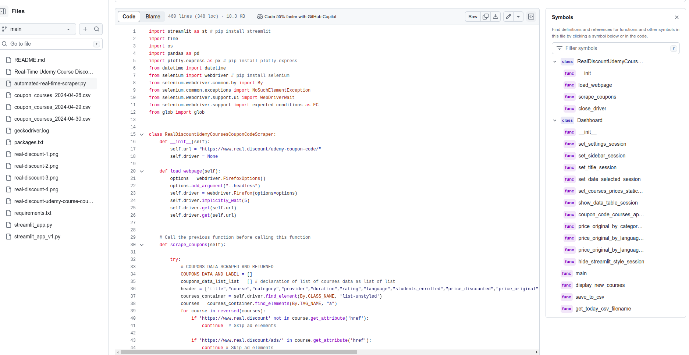

# real-discount-udemy-coupon-code-scraper-in-real-time
real discount udemy coupon code scraper in real time

### **Real-Time Udemy Course Discounts Scraper Dashboard**

### **Overview**
This dashboard provides real-time updates on Udemy course discounts scraped from the Real Discount website. It utilizes Selenium to scrape coupon data and Streamlit for dashboard visualization. Users can filter courses based on various criteria, view statistics, and apply coupon codes directly from the dashboard.

### **Setup**
Ensure you have Python installed along with the necessary libraries like `streamlit`, `pandas`, `plotly-express`, and `selenium`.

### **Usage**
1. Run the script.
2. Select the file containing Udemy course data based on your preferred date.
3. Filter courses based on category, duration, provider, rating, language, students enrolled, price, and views.
4. View statistics such as total original courses price, average rating, and average original courses price.
5. Apply coupon codes to available courses.
6. Monitor real-time updates on newly available coupons.

### **How to Run**
1. Install the necessary libraries using `pip install streamlit pandas plotly-express selenium`.
2. Run the script.
3. Follow the prompts to interact with the dashboard.

### **Dependencies**
- Python 3.x
- Libraries: `streamlit`, `pandas`, `plotly-express`, `selenium`

### **Notes**
- Ensure the WebDriver for Selenium is installed and configured properly.
- Customize the filtering options and dashboard layout according to your preferences.
- Monitor real-time updates periodically for new course discounts.

### **Contributors**
- Gabin H. VEGLO

### **License**
#**This project is licensed under the MIT License.**#

